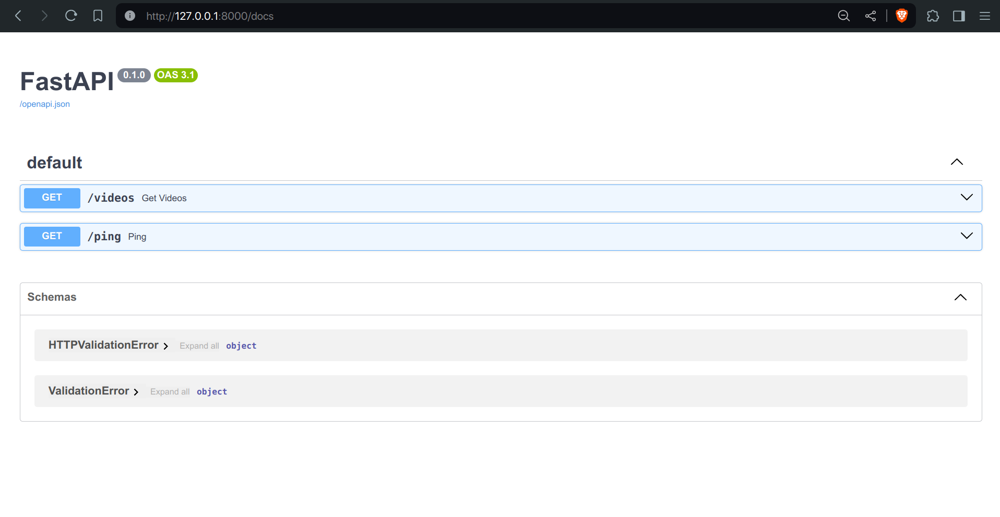
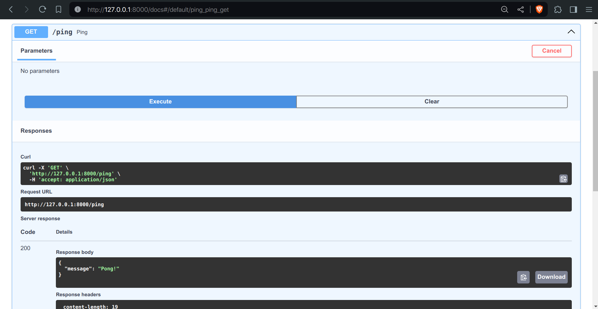
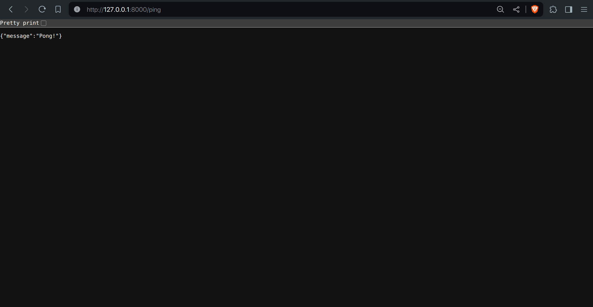
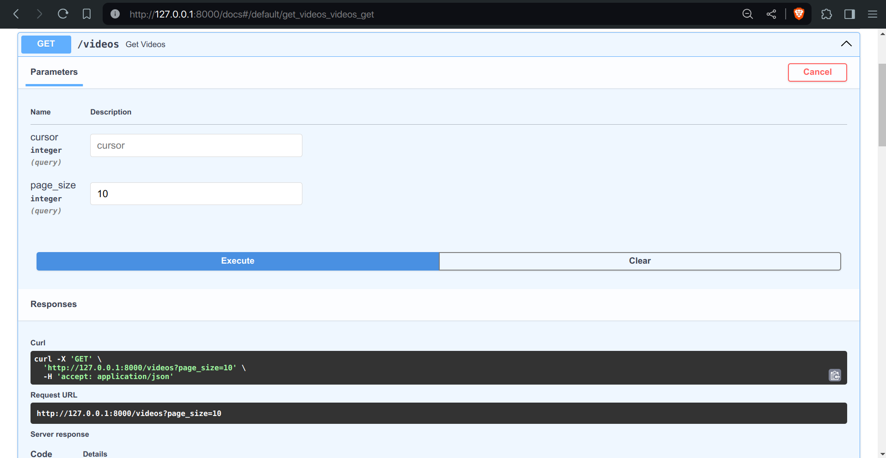
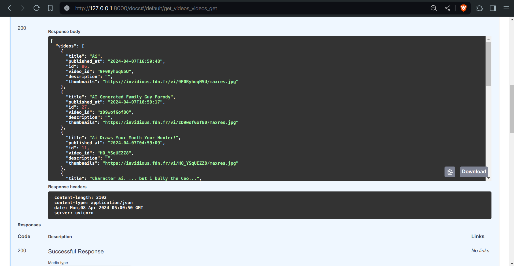
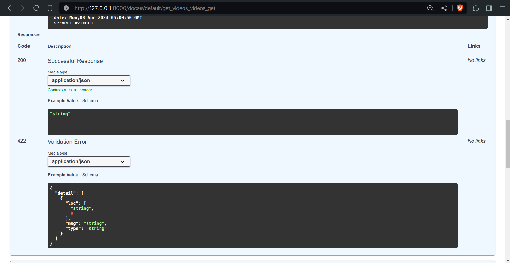
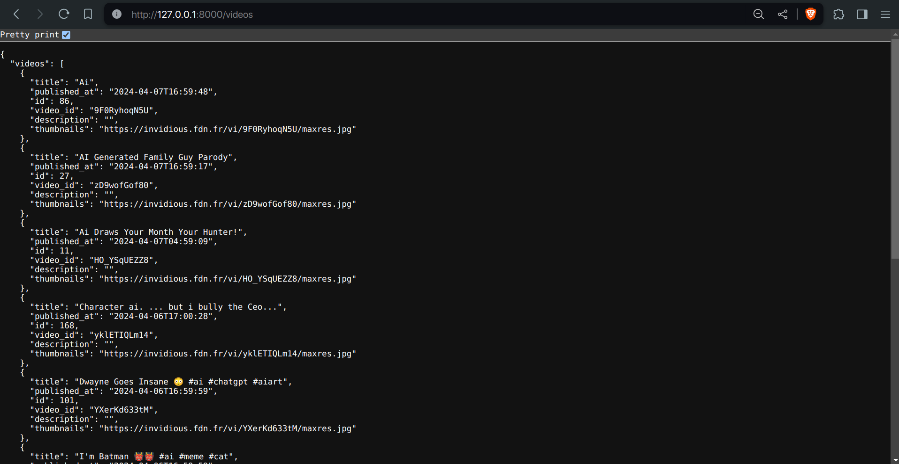
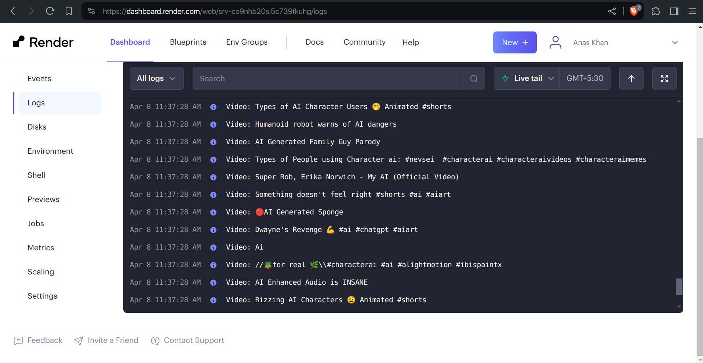

# FamPay Backend Assignment
#### Starting Time : 10:15am
#### Deadline : <24 hours

<details>
  <summary><strong>Backend Assignment Details</strong></summary>
  
  # Project Goal

  To make an API to fetch latest videos sorted in reverse chronological order of their publishing date-time from YouTube for a given tag/search query in a paginated response.

  # Basic Requirements:

  - Server should call the YouTube API continuously in background (async) with some interval (say 10 seconds) for fetching the latest videos for a predefined search query and should store the data of videos (specifically these fields - Video title, description, publishing datetime, thumbnails URLs and any other fields you require) in a database with proper indexes.
  - A GET API which returns the stored video data in a paginated response sorted in descending order of published datetime.
  - It should be scalable and optimised.

  # Bonus Points:

  - Add support for supplying multiple API keys so that if quota is exhausted on one, it automatically uses the next available key.
  - Make a dashboard to view the stored videos with filters and sorting options (optional)

  # Instructions:

  - You are free to choose any search query, for example: official, cricket, football etc. (choose something that has high frequency of video uploads)
  - Try and keep your commit messages clean, and leave comments explaining what you are doing wherever it makes sense.
  - Also try and use meaningful variable/function names, and maintain indentation and code style.
  - Submission should have a `README` file containing instructions to run the server and test the API.
  - Accepted language & Framework
    1. Python (DRF, Django, Flask, etc)
    2. GoLang
  - Send your submission (Git repository) link at hiring@fampay.in

  # Reference:

  - YouTube data v3 API: [https://developers.google.com/youtube/v3/getting-started](https://developers.google.com/youtube/v3/getting-started)
  - Search API reference: [https://developers.google.com/youtube/v3/docs/search/list](https://developers.google.com/youtube/v3/docs/search/list)
      - To fetch the latest videos you need to specify these: type=video, order=date, publishedAfter=<SOME_DATE_TIME>
      - Without publishedAfter, it will give you cached results which will be too old
</details>


This repository contains the code for the backend assignment for the FamPay internship. The project is focused on creating an API to fetch the latest videos from YouTube for a given search query, and storing the video data in a database. The API provides a paginated response to retrieve the stored video data sorted in descending order of the published datetime.

## Tech Stack

- **Language**: Python 3.10
- **Framework**: FastAPI
- **Database**: SQLite (SQLAlchemy)
- **Caching**: Redis
- **Task Scheduling**: APScheduler
- **APIs**: YouTube Data API, Invidious API

## Architecture Overview

The project follows a modular architecture, with different components responsible for specific tasks. The main components are:

1. **API Routes**: Handles the API endpoints for fetching videos and health checks.
2. **Core**: Contains the logic for fetching videos from YouTube and Invidious APIs.
3. **Database**: Manages the database connection and creation of tables.
4. **Models**: Defines the database models for storing video data and fetch history.
5. **Utils**: Includes utility functions for configuration, task scheduling, and more.

## Design Choices


1. **FastAPI**: 

FastAPI is a modern, fast, and high-performance web framework for building APIs. It provides automatic data validation and interactive API documentation. 

FamPay uses Python based backend.

FastAPI is significantly faster, benchmark [here](https://fastapi.tiangolo.com/benchmarks) than Flask, Django, and DjangoDRF, making it the ideal choice.


2. **SQLite**: 

SQLite is a lightweight, file-based, and self-contained database management system. It is chosen for its simplicity and ease of use in this project. Fampay uses relational database (PostgreSQL). A relational database is a no brainer for its ACID properties and strong validation,ORM, as there is a lot of structured data insertion in this project. 

Moreover, it will perform faster than non-relational databases, as most relational databases and some NoSQL databases (e.g., MongoDB) use B-trees, which are better for reads than writes. SQLite was chosen as it is file-based and eases deployment and development.

3. **Redis**: 

Redis is an in-memory data structure store used for caching the last successful fetch timestamp. This ensures that the application can continue fetching videos from the correct point even after a restart or failure. It was also chosen to store the most recently fetched videos into memory rather than disk, making retrieval via the `/videos` route faster when accessing from memory than disk (only for the first response; later responses will be paginated).

Fampay also uses Redis for key-value in-memory database caching.

4. **APScheduler**: 

APScheduler is a Python library for scheduling tasks to run periodically or at specific intervals. It is used to periodically fetch new videos from the YouTube API. This provides scheduling without having to use Celery or setting up a cron job, making the entire application cohesivenand keeping the monolithic architecture.

5. **Invidious API**: 

The Invidious API is used as a fallback in case all the provided YouTube API keys exceed their quotas. This ensures that the application can continue fetching videos even when the YouTube API is not provided or has exceeded its quota. The Invidious API does not use any API keys; users can define which API source they want from any of the Invidious instances from [here](https://api.invidious.io/).

6. **Cursor-based Pagination**: 

Cursor-based pagination is implemented to retrieve videos in a paginated manner. This approach is more efficient than offset-based pagination, especially when dealing with large datasets. 

It was specifically chosen in cases where a user requests a new page of videos and the database has been updated with new videos, to prevent sending back the same video data to the user. 

Cursor-based pagination simplifies that. For further reading on cursor pagination, see [here](https://dev.to/appwrite/this-is-why-you-should-use-cursor-pagination-4nh5).

7. **Docker**: 

Docker is used to containerize the application, making it easier to deploy and run in different environments.

Docker is used by everyone.

## Getting Started

To run the project locally, follow these steps:

1. Clone the repository:

```bash
git clone https://github.com/anxkhn/fampay-backend-assignment.git
```

2. Create a `.env` file 
   * Rename `.example.env` to `.env`.
* Fill in:
  * `SQLALCHEMY_DATABASE_URL` (Database connection string)
  * `GOOGLE_API_KEYS` (Optional, comma-separated YouTube API keys)
  * `QUERY` (Search query for YouTube videos)
* Others (optional, defaults provided):
  * `TIME_DELTA` (Interval between checks for new videos)
  * `TIME_DELAY` (Delay between successful fetches)
  * `REDIS_HOST` (Redis server hostname/IP)
  * `REDIS_PORT` (Redis server port)
  * `INVIDIOUS_API` (Invidious API endpoint URL, find a list of working INVIDIOUS_API here https://api.invidious.io)

## Running the application

This application can be run either locally or using Docker. Choose the method that best suits your environment.

**Setup**

1. **Prerequisites:**
   * Python 3.10+
   * pip (package installer)
2. **Clone the repository:**
   ```bash
   git clone https://github.com/anxkhn/fampay-backend-assignment
   ```


**Virtual Environment Setup**

3. **Create a virtual environment:**
   ```bash
   cd fampay-backend-assignment
   python -m venv env
   ```

4. **Activate the virtual environment:**
   - On Windows:
     ```bash
     .\env\Scripts\activate
     ```
   - On macOS and Linux:
     ```bash
     source env/bin/activate
     ```

5. **Install dependencies within the virtual environment:**
   ```bash
   pip install -r requirements.txt
   ```

**Local Setup**

6. **Set up Redis:**
      * Download Redis: [https://redis.io/download/](https://redis.io/download/)
      * Install instructions (based on your OS): [https://redis.io/docs/install/install-redis/](https://redis.io/docs/install/install-redis/)

      * Use the following command to run the Redis server

        ```bash
        redis-server
        ```

   * Make sure the Redis server is running on the default port (6379) unless you specify a different port in the `.env` file.

7. **Run the application within the virtual environment:**
    ```bash
    cd src && uvicorn app:app --reload
    ```

    The API will be accessible at `http://localhost:8000`.

With these instructions, users will be guided on how to set up and run the application within a virtual environment.


**OR: Running with Docker**

3. **Prerequisites:**

   * Docker installed on your system: [https://www.docker.com/](https://www.docker.com/)
   * Docker Compose installed: [https://docs.docker.com/compose/install/](https://docs.docker.com/compose/install/)

4. **Run with Docker Compose:**

   ```bash
   docker-compose up
   ```

   This will build a Docker image, start the necessary services (app and Redis), and run the application on port 8000.


5. Build and run the Docker containers:

```bash
docker-compose up --build
```

The API will be accessible at `http://localhost:8000`.

Incorporating FastAPI into your project not only provides robust API functionality but also seamlessly integrates with Swagger UI, allowing for easy API documentation and exploration. Let's elaborate on the provided API endpoints and Swagger UI integration:

### API Endpoints

#### Health Check

- **Endpoint**: `GET /ping`
- **Purpose**: This endpoint serves as a simple health check for the API. It returns a "Pong!" message, indicating that the API is operational.

#### Fetch Videos

- **Endpoint**: `GET /videos`
- **Parameters**:
  - `cursor` (optional): A cursor value for pagination. If not provided, it fetches the first page of results.
  - `page_size` (optional, default: 10): The number of videos to return per page.
- **Purpose**: This endpoint retrieves a paginated list of videos sorted by their publish date in descending order. It allows clients to fetch videos with optional pagination parameters.
- **Expected Response**:
  ```json
  {
    "videos": [
      {
        "video_id": "...",
        "title": "...",
        "description": "...",
        "published_at": "...",
        "thumbnails": "..."
      },
      // ... other videos
    ],
    "next_cursor": "..." // (optional) ID of the last video in the current page
  }
  ```

### Swagger UI Integration

#### `/docs`

Swagger UI provides an interactive documentation interface for exploring the API endpoints. It offers a user-friendly way to understand the available endpoints, their parameters, and expected responses.

- **Screenshot 1**: Overview of the Swagger UI interface.
  

#### Ping (HealthCheck)

- **Screenshot 2**: Shows the endpoint for health check (`GET /ping`) in Swagger UI.
  

- **Screenshot 3**: Demonstrates the response received upon pinging the health check endpoint.
  

#### Fetch Videos

- **Screenshot 4,5 & 6**: Illustrates the endpoint for fetching videos (`GET /videos`) in Swagger UI.
  

  

  

- **Screenshot 7**: Shows an example of a response when fetching videos using the `/videos` endpoint.
  

## Deployed Version

A live version of the application is available at [https://fampay-backend-assignment.onrender.com](https://fampay-backend-assignment.onrender.com). 

However, due to the nature of this project, which involves constant fetching of videos and Redis caching, the free quota is quickly exhausted.

Upon accessing the deployed version, please note the following:

1. **Cold Start Delay**: There might be a delay of up to 50 seconds for the initial response due to the nature of free services on Render. This delay occurs during the startup of the server.

2. **Health Check**: To ensure that the server is operational, you can access the `/ping` endpoint [here](https://fampay-backend-assignment.onrender.com/ping). A successful response indicates that the server is healthy and operational.

**Logs**: You can view the project logs, including information about video fetching and server operations, in real-time on the deployed version. Here's a screenshot of the project logs:

   

Please note that the deployed version might experience frequent downtime or performance issues due to resource limitations in the free tier. Therefore, it is **not recommeneded** to  explore the API endpoints and functionality of the project without setting up the application locally.

## Docker Compose

The `compose.yaml` file defines two services:

1. **app**: The main application service built from the provided `Dockerfile`.
2. **redis**: A Redis instance used for caching.

The application service depends on the Redis service, ensuring that Redis is available before starting the application.

## Scheduler

The `utils/scheduler.py` module sets up a background scheduler using APScheduler. The `fetch_youtube_videos` function from `core/fetch_videos.py` is scheduled to run periodically at the interval specified by the `TIME_DELAY` environment variable.

## Fetch Videos

The `core/fetch_videos.py` module contains the core logic for fetching videos from the YouTube and Invidious APIs. It handles the following tasks:

1. Determining the last successful fetch time from Redis or the database.
2. Fetching videos from the YouTube API using the provided API keys in a round-robin fashion. If all keys exceed their quotas, it switches to the Invidious API.
3. Storing the fetched video data in the database.
4. Updating the fetch history in the database and caching the last successful fetch time in Redis.

The module also includes utility functions for interacting with the database and processing the API responses.

## Database Models

The `models.py` module defines two database models:

1. **videos**:
   - `id` (Integer, Primary Key, Index): Unique identifier for each video record.
   - `video_id` (String, Index): The unique identifier of the video from the YouTube API.
   - `title` (String): The title of the video.
   - `description` (String): The description of the video.
   - `published_at` (DateTime): The datetime when the video was published.
   - `thumbnails` (String): The URL of the video thumbnail.

2. **fetch_history**:
   - `id` (Integer, Primary Key, Index): Unique identifier for each fetch history record.
   - `last_video_id` (String): The video ID of the last fetched video.
   - `last_fetch_time` (DateTime): The datetime of the last successful video fetch.

The `videos` table stores the essential information about each fetched video, while the `fetch_history` table keeps track of the last successful fetch to resume the fetching process from the correct point.

## File Structue and Breakdown

```
fampay-backend-assignment
├── .example.env
├── .gitignore
├── Dockerfile
├── LICENSE
├── README.md
├── compose.yaml
├── docs/
│   ├── links.md
│   ├── planned.md
│   └── tasks.md
├── requirements.txt
└── src/
    ├── app.py
    ├── core/
    │   └── fetch_videos.py
    ├── database.py
    ├── models.py
    ├── routes/
    │   ├── ping.py
    │   └── videos.py
    └── utils/
        ├── config.py
        └── scheduler.py
```


1. `src/app.py`: This file sets up the FastAPI application and includes the routes for videos and health checks. It also creates the database tables and starts the scheduler on application startup.

2. `src/database.py`: This module handles the database connection and provides functions to create the database tables and obtain a session for interacting with the database.

3. `src/models.py`: This file defines the SQLAlchemy models for the `videos` and `fetch_history` tables, which map to the respective database tables.

4. `src/routes/videos.py`: This module defines the `/videos` endpoint for fetching paginated video data from the database.

5. `src/routes/ping.py`: This module defines the `/ping` endpoint for performing a health check on the API.

6. `src/core/fetch_videos.py`: This is the core module responsible for fetching videos from the YouTube and Invidious APIs. It contains functions for interacting with the APIs, processing the responses, and storing the video data in the database.

7. `src/utils/config.py`: This module loads the environment variables and makes them available as constants for use throughout the application.

8. `src/utils/scheduler.py`: This module sets up the background scheduler using APScheduler and schedules the `fetch_youtube_videos` function to run periodically based on the `TIME_DELAY` configuration.

9. `Dockerfile`: This file contains the instructions for building the Docker image for the application.

10. `compose.yaml`: This file defines the Docker Compose services for running the application and the Redis instance.

11. `requirements.txt`: This file lists the Python dependencies required by the application.

12. `docs/tasks.md`: This file contains the original assignment description and requirements.

13. `docs/planned.md`: This file lists the planned features and tasks for the project.

14. `docs/links.md`: This file is used to store relevant links or design choices.